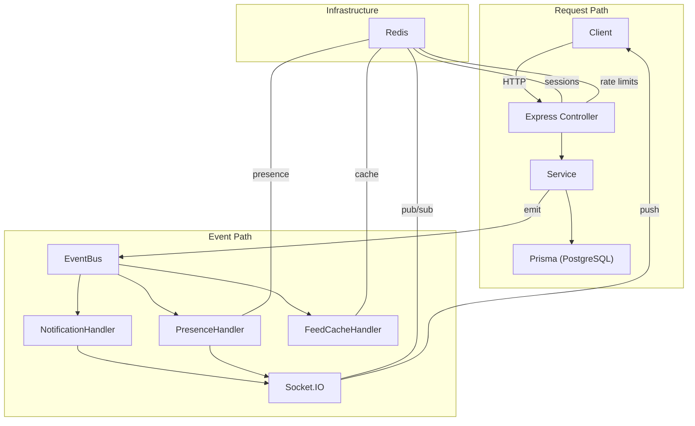
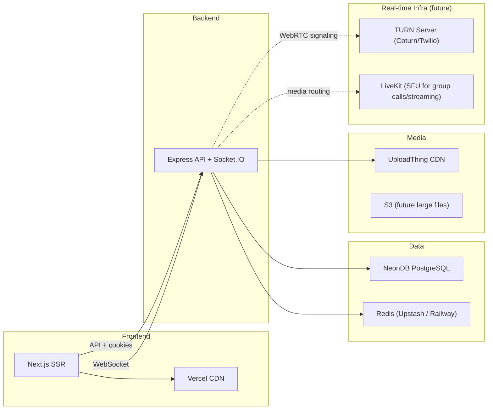

# Quibble: Production Architecture Migration Plan (v2)

> Revised based on senior architect review. Changes from v1 are marked with 🆕.

---

## Part 1 — Complete Codebase Audit

*(Unchanged from v1 — all findings remain valid. See [v1 audit](#) for the full inventory of 15 API routes, 10 server actions, 12 database models, 7 shared libraries, and all identified issues.)*

### Quick Recap of Critical Findings

| #  | Severity | Issue                                                                       |
| -- | -------- | --------------------------------------------------------------------------- |
| A1 | 🔴       | No middleware.ts — every endpoint independently calls`validateRequest()` |
| A3 | 🟠       | Duplicated base32 encoding across 2 files                                   |
| A4 | 🟠       | Duplicated argon2 config across 3 files                                     |
| S1 | 🔴       | No rate limiting on auth endpoints                                          |
| S3 | 🟠       | OTP uses`Math.random()` — not cryptographically secure                   |
| S5 | 🟠       | Link preview is vulnerable to SSRF                                          |
| P1 | 🟠       | Trending topics does full-table regex scan                                  |

---

## Part 2 — Target Architecture

### 2.1 Core Architecture Pattern 🆕

The system is **event-driven at its core**, not just request-response CRUD.



**The key insight:** Likes, comments, follows, shares, messages — they're all **events**. The controller handles the HTTP request, the service does the business logic and persists to Postgres, then **emits an event**. Downstream handlers (notifications, socket pushes, feed cache invalidation) react to that event independently. This decouples features and makes the system naturally extensible for real-time.

### 2.2 Monorepo Structure 🆕

```
quibble/
├── apps/
│   ├── web/                              # Next.js — frontend only
│   │   ├── src/
│   │   │   ├── app/                      # App Router (pages + layouts)
│   │   │   │   ├── (auth)/
│   │   │   │   ├── (main)/
│   │   │   │   ├── layout.tsx
│   │   │   │   └── globals.css
│   │   │   ├── components/               # React UI components
│   │   │   │   ├── comments/
│   │   │   │   ├── follow/
│   │   │   │   ├── posts/
│   │   │   │   └── ui/
│   │   │   ├── hooks/                    # React Query hooks + custom hooks
│   │   │   ├── lib/
│   │   │   │   ├── api-client.ts         # HTTP client → Express backend
│   │   │   │   ├── socket-client.ts      # Socket.IO client 🆕
│   │   │   │   ├── media-utils.ts        # Client-side image/video processing
│   │   │   │   └── utils.ts             # cn(), formatRelativeDate, formatNumber
│   │   │   └── providers/
│   │   │       ├── ReactQueryProvider.tsx
│   │   │       ├── SessionProvider.tsx
│   │   │       └── SocketProvider.tsx    # 🆕
│   │   ├── next.config.mjs
│   │   ├── tailwind.config.ts
│   │   └── package.json
│   │
│   └── server/                           # Express.js backend
│       ├── src/
│       │   ├── app.ts                    # Express app (middleware stack)
│       │   ├── server.ts                 # HTTP server + Socket.IO bootstrap
│       │   │
│       │   ├── config/
│       │   │   ├── env.ts               # Zod-validated env vars (fail fast)
│       │   │   ├── cors.ts
│       │   │   ├── database.ts          # Prisma singleton
│       │   │   └── redis.ts             # 🆕 Redis client (ioredis)
│       │   │
│       │   ├── modules/                  # Feature-based modules
│       │   │   ├── auth/
│       │   │   │   ├── auth.controller.ts
│       │   │   │   ├── auth.service.ts
│       │   │   │   ├── auth.dto.ts      # 🆕
│       │   │   │   ├── auth.validation.ts
│       │   │   │   └── auth.routes.ts
│       │   │   ├── users/
│       │   │   │   ├── users.controller.ts
│       │   │   │   ├── users.service.ts
│       │   │   │   ├── users.dto.ts     # 🆕
│       │   │   │   ├── users.validation.ts
│       │   │   │   └── users.routes.ts
│       │   │   ├── posts/
│       │   │   │   ├── posts.controller.ts
│       │   │   │   ├── posts.service.ts
│       │   │   │   ├── posts.dto.ts     # 🆕
│       │   │   │   ├── posts.validation.ts
│       │   │   │   └── posts.routes.ts
│       │   │   ├── comments/
│       │   │   │   ├── comments.controller.ts
│       │   │   │   ├── comments.service.ts
│       │   │   │   ├── comments.dto.ts  # 🆕
│       │   │   │   └── comments.routes.ts
│       │   │   ├── reactions/
│       │   │   │   ├── reactions.controller.ts
│       │   │   │   ├── reactions.service.ts
│       │   │   │   └── reactions.routes.ts
│       │   │   ├── follow/
│       │   │   │   ├── follow.controller.ts
│       │   │   │   ├── follow.service.ts
│       │   │   │   └── follow.routes.ts
│       │   │   ├── bookmarks/
│       │   │   │   ├── bookmarks.controller.ts
│       │   │   │   ├── bookmarks.service.ts
│       │   │   │   └── bookmarks.routes.ts
│       │   │   ├── feed/
│       │   │   │   ├── feed.controller.ts
│       │   │   │   ├── feed.service.ts
│       │   │   │   └── feed.routes.ts
│       │   │   ├── uploads/             # 🆕 Renamed from "media"
│       │   │   │   ├── uploads.controller.ts
│       │   │   │   ├── uploads.service.ts
│       │   │   │   └── uploads.routes.ts
│       │   │   ├── notifications/       # 🆕 Explicit module
│       │   │   │   ├── notifications.controller.ts
│       │   │   │   ├── notifications.service.ts
│       │   │   │   ├── notifications.events.ts   # Event handlers
│       │   │   │   └── notifications.routes.ts
│       │   │   ├── messages/            # 🆕 Placeholder
│       │   │   │   ├── messages.controller.ts
│       │   │   │   ├── messages.service.ts
│       │   │   │   ├── messages.dto.ts
│       │   │   │   └── messages.routes.ts
│       │   │   ├── presence/            # 🆕 Placeholder
│       │   │   │   ├── presence.service.ts
│       │   │   │   └── presence.events.ts
│       │   │   ├── calls/               # 🆕 Placeholder
│       │   │   │   ├── calls.service.ts
│       │   │   │   └── calls.events.ts
│       │   │   ├── live/                # 🆕 Placeholder
│       │   │   │   ├── live.service.ts
│       │   │   │   └── live.events.ts
│       │   │   ├── search/              # 🆕 Placeholder
│       │   │   │   ├── search.controller.ts
│       │   │   │   ├── search.service.ts
│       │   │   │   └── search.routes.ts
│       │   │   └── admin/               # 🆕 Placeholder
│       │   │       ├── admin.controller.ts
│       │   │       └── admin.routes.ts
│       │   │
│       │   ├── events/                  # 🆕 Internal event bus
│       │   │   ├── event-bus.ts         # Node EventEmitter (→ BullMQ later)
│       │   │   ├── event-types.ts       # Typed event definitions
│       │   │   └── handlers/            # Event subscribers
│       │   │       ├── notification.handler.ts
│       │   │       ├── feed-cache.handler.ts
│       │   │       └── socket-push.handler.ts
│       │   │
│       │   ├── socket/                  # 🆕 Restructured
│       │   │   ├── index.ts            # Socket.IO server setup
│       │   │   ├── middleware/
│       │   │   │   ├── auth.ts         # Socket session validation
│       │   │   │   └── rate-limit.ts   # Socket rate limiting
│       │   │   ├── handlers/
│       │   │   │   ├── chat.handler.ts
│       │   │   │   ├── presence.handler.ts
│       │   │   │   ├── call.handler.ts
│       │   │   │   ├── notification.handler.ts
│       │   │   │   └── live.handler.ts
│       │   │   ├── rooms/
│       │   │   │   ├── room-manager.ts  # Room lifecycle
│       │   │   │   └── room-types.ts
│       │   │   ├── events/
│       │   │   │   ├── event-map.ts     # Typed client ↔ server events
│       │   │   │   └── emitters.ts      # Typed emit helpers
│       │   │   └── adapters/
│       │   │       └── redis-adapter.ts # Socket.IO Redis adapter
│       │   │
│       │   ├── integrations/            # 🆕 Renamed from "services"
│       │   │   ├── email/
│       │   │   │   ├── email.service.ts
│       │   │   │   └── templates/       # HTML email templates
│       │   │   ├── uploadthing/
│       │   │   │   └── upload.service.ts
│       │   │   ├── tenor/
│       │   │   │   └── tenor.service.ts
│       │   │   └── opengraph/
│       │   │       └── link-preview.service.ts
│       │   │
│       │   ├── middleware/
│       │   │   ├── authenticate.ts      # Session → req.user
│       │   │   ├── validate.ts          # Zod schema → req.body
│       │   │   ├── rate-limit.ts        # Redis-backed rate limiting 🆕
│       │   │   ├── request-logger.ts    # 🆕 Pino request logging
│       │   │   └── error-handler.ts     # Global error handler
│       │   │
│       │   ├── logging/                 # 🆕
│       │   │   └── logger.ts            # Pino logger instance
│       │   │
│       │   ├── monitoring/              # 🆕
│       │   │   ├── health.ts            # GET /health, /ready, /live
│       │   │   └── sentry.ts            # Sentry error tracking setup
│       │   │
│       │   ├── jobs/
│       │   │   ├── scheduler.ts         # node-cron job runner
│       │   │   └── cleanup-media.ts
│       │   │
│       │   └── types/
│       │       ├── express.d.ts         # Extend Request with user, session
│       │       └── index.ts
│       │
│       ├── prisma/
│       │   └── schema.prisma
│       ├── tsconfig.json
│       └── package.json
│
└── packages/
    └── shared/
        ├── src/
        │   ├── validation/              # Zod schemas (used by both sides)
        │   │   ├── auth.schema.ts
        │   │   ├── post.schema.ts
        │   │   ├── user.schema.ts
        │   │   └── comment.schema.ts
        │   ├── dto/                     # 🆕 Data Transfer Objects
        │   │   ├── auth.dto.ts
        │   │   ├── post.dto.ts
        │   │   ├── user.dto.ts
        │   │   └── pagination.dto.ts
        │   ├── types/                   # API response interfaces
        │   │   ├── api.types.ts         # PostsPage, CommentsPage, etc.
        │   │   ├── reaction.types.ts
        │   │   ├── follower.types.ts
        │   │   └── bookmark.types.ts
        │   ├── constants/
        │   │   ├── auth.constants.ts    # Argon2 config, session duration
        │   │   ├── pagination.constants.ts
        │   │   └── media.constants.ts
        │   └── events/                  # 🆕 Event type definitions
        │       └── event-types.ts       # Shared between server + socket
        ├── tsconfig.json
        └── package.json
```

### 2.3 Key Architectural Decisions

#### Why Modular Monolith, Not Microservices

The current feature set is tightly coupled around a single PostgreSQL database. Splitting into microservices now would add distributed transaction complexity with zero benefit. The module-based structure allows extracting any module into a standalone service later by pulling its directory out and adding a message queue.

#### Why Express over Fastify/Hono

Express has the largest middleware ecosystem (Helmet, cors, express-rate-limit), the deepest Socket.IO integration, and the most familiar DX. For WebRTC signaling and real-time features, Express + Socket.IO is the battle-tested combination used by Discord and Slack at their early stages.

#### Why Keep Prisma (Not Drizzle/Knex)

Prisma is deeply integrated. The schema, migrations, and type generation all work. Switching ORMs would be a lateral move with high risk and no benefit. Prisma's generated types are a strength.

#### Why No Repository Layer

Prisma already acts as a typed data access layer. Wrapping it in a repository pattern creates `PrismaWrapper → Prisma` — adding a layer with zero value. Services call Prisma directly. If the ORM ever changes, the service layer is the refactoring boundary.

#### Session Cookies, Not JWT

The current session-cookie approach is correct. Sessions are server-side in PostgreSQL (cached in Redis), cookies are `httpOnly + SameSite=lax + Secure`. More secure than JWT for browser auth. The Express backend validates session cookies via middleware.

#### Why DTOs 🆕

DTOs define the **contract** between frontend and backend. They're distinct from Prisma models (internal) and Zod schemas (validation). When a mobile app, admin panel, or API v2 arrives, DTOs ensure backward compatibility without touching business logic.

---

## Part 3 — Event-Driven Architecture 🆕

This is the single biggest architectural improvement over v1. Instead of services directly calling each other, they communicate through an event bus.

### 3.1 Event Bus

```typescript
// events/event-bus.ts
import { EventEmitter } from "events";
import { AppEvent, EventMap } from "./event-types";

class EventBus {
  private emitter = new EventEmitter();

  emit<T extends AppEvent>(event: T, payload: EventMap[T]) {
    this.emitter.emit(event, payload);
  }

  on<T extends AppEvent>(event: T, handler: (payload: EventMap[T]) => void) {
    this.emitter.on(event, handler);
  }
}

export const eventBus = new EventBus();
```

### 3.2 Typed Events

```typescript
// events/event-types.ts
export type AppEvent =
  | "post:created"
  | "post:deleted"
  | "post:liked"
  | "post:disliked"
  | "post:bookmarked"
  | "comment:created"
  | "comment:liked"
  | "user:followed"
  | "user:unfollowed"
  | "message:sent"
  | "message:read"
  | "call:initiated"
  | "call:ended"
  | "live:started"
  | "live:ended";

export interface EventMap {
  "post:liked": { postId: string; userId: string; authorId: string };
  "comment:created": { commentId: string; postId: string; authorId: string; commenterId: string };
  "user:followed": { followerId: string; followingId: string };
  // ... etc
}
```

### 3.3 How It Flows

```
User clicks "Like"
  → POST /api/posts/:id/like
  → reactions.controller.ts (HTTP concerns)
  → reactions.service.ts (toggle like in Postgres)
  → eventBus.emit("post:liked", { postId, userId, authorId })
  ↓
  → notification.handler.ts (save notification to DB)
  → socket-push.handler.ts (push to author's socket room)
  → feed-cache.handler.ts (invalidate Redis feed cache)
```

The service **never knows** about notifications, sockets, or caching. It just emits an event and returns. Handlers subscribe independently. This means adding "send push notification on like" later requires zero changes to the reactions service.

### 3.4 Migration Path

```
Phase 1: EventEmitter (Node built-in, zero dependencies, in-process)
Phase 2: BullMQ + Redis (persistent queues, retries, scheduled jobs)
Phase 3: If needed: separate worker processes consuming from Redis queues
```

---

## Part 4 — Redis Architecture 🆕

Redis is the **second most important service** after Postgres. It's added from day one.

### 4.1 Redis Use Cases

| Use Case                     | Key Pattern                                        | TTL       |
| ---------------------------- | -------------------------------------------------- | --------- |
| **Session cache**      | `session:{sessionId}` → `{userId, expiresAt}` | 30 days   |
| **Rate limiting**      | `ratelimit:{ip}:{endpoint}` → counter           | 1–15 min |
| **Presence**           | `presence:{userId}` → `{socketId, lastSeen}`  | 5 min     |
| **Socket mapping**     | `socket:user:{userId}` → `Set<socketId>`      | Session   |
| **Typing indicators**  | `typing:{conversationId}:{userId}` → `1`      | 5 sec     |
| **OTP storage**        | `otp:{email}` → `{otp, attempts}`             | 10 min    |
| **Email cooldown**     | `email:cooldown:{email}` → `1`                | 1 min     |
| **Feed cache**         | `feed:foryou:{userId}:page:{n}` → JSON          | 5 min     |
| **Trending cache**     | `trending:hashtags` → JSON                      | 1 hour    |
| **Link preview cache** | `linkpreview:{urlHash}` → JSON                  | 24 hours  |

### 4.2 Redis Client Setup

```typescript
// config/redis.ts
import Redis from "ioredis";
import { env } from "./env";
import { logger } from "../logging/logger";

export const redis = new Redis(env.REDIS_URL, {
  maxRetriesPerRequest: 3,
  retryStrategy: (times) => Math.min(times * 200, 5000),
});

redis.on("connect", () => logger.info("Redis connected"));
redis.on("error", (err) => logger.error({ err }, "Redis error"));
```

### 4.3 Session Flow with Redis

```
Request arrives
  → authenticate middleware reads cookie
  → Check Redis: session:{id} exists?
    → Yes: attach user to req (0.1ms)
    → No: query Postgres, cache result in Redis (3ms first time, then 0.1ms)
  → Continue to route handler
```

---

## Part 5 — Socket.IO Architecture 🆕 (Restructured)

### 5.1 Structure

```
socket/
├── index.ts              # Server setup + namespace registration
├── middleware/
│   ├── auth.ts            # Validate session from cookie/handshake
│   └── rate-limit.ts      # Per-socket event rate limiting
├── handlers/
│   ├── chat.handler.ts    # message:send, message:read, message:typing
│   ├── presence.handler.ts # user:online, user:offline, heartbeat
│   ├── call.handler.ts    # WebRTC signaling (offer/answer/ICE)
│   ├── notification.handler.ts # Real-time notification push
│   └── live.handler.ts    # Live room management
├── rooms/
│   ├── room-manager.ts    # Create/join/leave/destroy room lifecycle
│   └── room-types.ts      # Room type definitions (DM, group, call, live)
├── events/
│   ├── event-map.ts       # Typed client↔server event contracts
│   └── emitters.ts        # Type-safe emit helpers
└── adapters/
    └── redis-adapter.ts   # @socket.io/redis-adapter for horizontal scaling
```

### 5.2 Typed Event Map

```typescript
// socket/events/event-map.ts
export interface ServerToClientEvents {
  "notification:new": (data: NotificationDTO) => void;
  "message:received": (data: MessageDTO) => void;
  "message:typing": (data: { userId: string; conversationId: string }) => void;
  "presence:update": (data: { userId: string; status: "online" | "offline" }) => void;
  "call:incoming": (data: { callId: string; from: UserDTO; type: "audio" | "video" }) => void;
  "call:ice-candidate": (data: { callId: string; candidate: RTCIceCandidate }) => void;
  "call:answer": (data: { callId: string; sdp: RTCSessionDescription }) => void;
  "call:end": (data: { callId: string; reason: string }) => void;
}

export interface ClientToServerEvents {
  "message:send": (data: { conversationId: string; content: string }, ack: (res: MessageDTO) => void) => void;
  "message:read": (data: { conversationId: string; messageId: string }) => void;
  "typing:start": (data: { conversationId: string }) => void;
  "typing:stop": (data: { conversationId: string }) => void;
  "call:initiate": (data: { targetUserId: string; type: "audio" | "video"; sdp: RTCSessionDescription }) => void;
  "call:accept": (data: { callId: string; sdp: RTCSessionDescription }) => void;
  "call:reject": (data: { callId: string }) => void;
  "call:ice-candidate": (data: { callId: string; candidate: RTCIceCandidate }) => void;
  "call:end": (data: { callId: string }) => void;
}
```

### 5.3 Handler Example

```typescript
// socket/handlers/presence.handler.ts
export function registerPresenceHandlers(io: Server, socket: AuthenticatedSocket) {
  const userId = socket.data.user.id;

  // Mark online
  redis.set(`presence:${userId}`, JSON.stringify({
    socketId: socket.id,
    lastSeen: Date.now(),
  }), "EX", 300);

  // Notify followers
  socket.broadcast.emit("presence:update", { userId, status: "online" });

  // Heartbeat
  socket.on("heartbeat", async () => {
    await redis.expire(`presence:${userId}`, 300);
  });

  // Disconnect
  socket.on("disconnect", async () => {
    await redis.del(`presence:${userId}`);
    socket.broadcast.emit("presence:update", { userId, status: "offline" });
  });
}
```

---

## Part 6 — Logging & Monitoring 🆕

### 6.1 Structured Logging (Pino)

```typescript
// logging/logger.ts
import pino from "pino";
import { env } from "../config/env";

export const logger = pino({
  level: env.LOG_LEVEL || "info",
  transport: env.NODE_ENV === "development"
    ? { target: "pino-pretty", options: { colorize: true } }
    : undefined,
  redact: ["req.headers.cookie", "req.headers.authorization"],
});
```

All `console.log` calls across the codebase will be replaced with `logger.info/warn/error`.

### 6.2 Request Logging Middleware

```typescript
// middleware/request-logger.ts
import pinoHttp from "pino-http";
import { logger } from "../logging/logger";

export const requestLogger = pinoHttp({
  logger,
  autoLogging: { ignore: (req) => req.url === "/health" },
  customLogLevel: (req, res, err) => {
    if (res.statusCode >= 500 || err) return "error";
    if (res.statusCode >= 400) return "warn";
    return "info";
  },
});
```

### 6.3 Health & Monitoring Endpoints

```typescript
// monitoring/health.ts
// GET /health — basic liveness check
// GET /ready — checks Postgres + Redis connectivity
// GET /live  — always 200 (Kubernetes liveness)
```

### 6.4 Sentry Integration

```typescript
// monitoring/sentry.ts
import * as Sentry from "@sentry/node";

export function initSentry() {
  if (!env.SENTRY_DSN) return;
  Sentry.init({
    dsn: env.SENTRY_DSN,
    environment: env.NODE_ENV,
    tracesSampleRate: env.NODE_ENV === "production" ? 0.1 : 1.0,
  });
}
```

---

## Part 7 — Security Hardening

| Improvement                     | Implementation                                                                               |
| ------------------------------- | -------------------------------------------------------------------------------------------- |
| **Rate limiting**         | `express-rate-limit` + Redis store — 5 req/min auth, 30 req/min writes, 120 req/min reads |
| **Security headers**      | `helmet()` — CSP, HSTS, X-Frame-Options, etc.                                             |
| **CORS**                  | Strict origin whitelist (`FRONTEND_URL` only), credentials: true                           |
| **CSRF**                  | `SameSite=lax` + origin header validation on mutating requests                             |
| **Secure OTP** 🆕         | `crypto.randomInt(100000, 999999)` — cryptographically secure                             |
| **OTP in Redis** 🆕       | Store OTP in Redis with TTL + attempt counter (max 5 attempts)                               |
| **SSRF protection**       | Link preview: validate URL against private IP ranges before fetching                         |
| **Input validation**      | Zod middleware on every route accepting a body or query params                               |
| **Error sanitization**    | Global handler strips stack traces in production, sends to Sentry                            |
| **Env validation**        | Zod schema validates all env vars at startup — fail fast                                    |
| **Structured logging** 🆕 | Pino replaces all console.log — no sensitive data leaks                                     |

---

## Part 8 — Performance Optimizations

| Optimization                    | Details                                                                                                   |
| ------------------------------- | --------------------------------------------------------------------------------------------------------- |
| **Session caching** 🆕    | Redis-backed session lookup (0.1ms vs 3ms Postgres)                                                       |
| **Feed caching** 🆕       | Cache feed pages in Redis for 5 min, invalidate on post:created events                                    |
| **Trending topics**       | Pre-compute in Redis. Cron job aggregates every hour, stores result. Zero DB load on reads.               |
| **Like/dislike toggle**   | Single upsert + single count query instead of read-check-write-count pattern                              |
| **Link preview cache** 🆕 | Redis with 24h TTL replaces Next.js`unstable_cache`                                                     |
| **Pagination**            | Already using cursor pagination — keep it. Add composite indexes on`(postId, createdAt)` for comments. |
| **Response compression**  | `compression()` middleware for gzip/brotli                                                              |
| **Connection pooling**    | PgBouncer or Prisma Accelerate for production NeonDB                                                      |

---

## Part 9 — Deployment Architecture 🆕



> [!IMPORTANT]
> **Domain strategy:** Deploy frontend as `quibble.com` and backend as `api.quibble.com`. Both share the parent domain `.quibble.com`, so session cookies with `Domain=.quibble.com` work naturally with `SameSite=lax`. This avoids the cross-origin cookie complexity of `SameSite=None`.

### TURN Server Planning 🆕

Without a TURN server, ~15-20% of users behind restrictive NATs or corporate firewalls won't be able to establish peer-to-peer media connections for voice/video calls.

**Phase 1:** Use a managed TURN service (Twilio Network Traversal, Metered.ca) — zero infrastructure.
**Phase 2:** Self-host Coturn on a VPS with good bandwidth if cost matters.
**Phase 3:** When group calls/streaming arrive, add LiveKit as an SFU (Selective Forwarding Unit) to relay media efficiently.

---

## Part 10 — Step-by-Step Migration Plan

> [!IMPORTANT]
> Each phase is independently deployable. The frontend and backend coexist during migration — API routes in Next.js are retired one module at a time.

### Phase 1: Monorepo Setup

- Initialize npm workspaces: `apps/web`, `apps/server`, `packages/shared`.
- Move existing Next.js project into `apps/web/`.
- Bootstrap `apps/server/` with Express, TypeScript, Prisma, Pino, ioredis.
- Bootstrap `packages/shared/` with Zod schemas and TypeScript interfaces.
- Configure shared `tsconfig` paths and build scripts.
- Set up `.env` files for both apps.

### Phase 2: Shared Package + DTOs 🆕

- Extract Zod schemas from `lib/validation.ts` → `packages/shared/validation/`.
- Extract API response types (`PostsPage`, `ReactionInfo`, etc.) → `packages/shared/types/`.
- Create DTOs (`CreatePostDTO`, `LoginDTO`, `UpdateProfileDTO`, etc.) → `packages/shared/dto/`.
- Extract constants (argon2 config, session duration, pagination sizes) → `packages/shared/constants/`.
- Define event types → `packages/shared/events/`.

### Phase 3: Express Foundation + Redis 🆕

- Set up Express app with full middleware stack: `helmet`, `cors`, `cookie-parser`, `compression`, `pino-http`, `rate-limit` (Redis-backed), error handler.
- Set up Redis client with ioredis.
- Port session management from `auth.ts` (remove React `cache()` dependency).
- Create `authenticate` middleware (Redis-cached session lookup).
- Create `validate` middleware (Zod schema wrapper).
- Create health/ready/live endpoints.
- Init Sentry.

### Phase 4: Event Bus 🆕

- Implement `EventBus` with Node's `EventEmitter`.
- Define all current event types.
- Create notification handler stub.
- Create socket-push handler stub.
- Create feed-cache handler stub.

### Phase 5: Auth Module

- Port login, signup, email verification, password reset, logout to Express.
- Port email service → `integrations/email/`.
- Move OTP storage from Postgres to Redis with attempt counter.
- Add rate limiting to auth endpoints (5 req/min).
- Fix OTP to use `crypto.randomInt()`.
- Consolidate argon2 config into shared constants.
- Remove duplicated base32 encoding.

### Phase 6: Posts & Feed Module

- Port post CRUD (create, edit, delete) to Express controllers + services.
- Port feed endpoints (for-you, following, my-posts, bookmarks).
- Port mention suggestion query.
- Add feed caching in Redis.
- Emit `post:created`, `post:deleted` events.

### Phase 7: Social Module

- Port reactions (like, dislike, bookmark) — emit events on each.
- Port comments (CRUD + replies + likes) — emit events.
- Port follow/unfollow + follower/following lists — emit events.
- Trending topics → pre-compute in Redis via cron.

### Phase 8: Integrations Module 🆕

- Port link preview with SSRF protection → `integrations/opengraph/`.
- Port Tenor GIF proxy → `integrations/tenor/`.
- Port UploadThing → `integrations/uploadthing/`.
- Port media cleanup to a scheduled Express job.
- Cache link previews in Redis.

### Phase 9: Frontend Migration

- Update `api-client.ts` to point to Express backend URL.
- Replace all server action calls with HTTP API calls.
- Remove all `"use server"` action files.
- Remove all `api/` route handlers from Next.js.
- Next.js now only does SSR, routing, and rendering.
- Keep lightweight `validateRequest` in Next.js for SSR page protection (calls Express `GET /auth/me`).
- Add `SocketProvider` for real-time client context.

### Phase 10: Socket.IO + Real-Time 🆕

- Add Socket.IO to Express server with Redis adapter.
- Implement socket auth middleware (session cookie validation).
- Implement presence handler (online/offline via Redis).
- Wire event bus → socket push handler (notifications push to connected clients).
- Scaffold chat, call, and live handlers as placeholders.

### Phase 11: Verification & Cleanup

- End-to-end test every feature against the Express backend.
- Remove dead code: empty `api/auth/`, unused `ws` package, stale imports.
- Enable TypeScript strict mode across all packages.
- Replace all `console.log` with Pino logger calls.
- Update deployment configs (Vercel for frontend, Railway for backend + Redis).
- Write API documentation (route map, event map, DTO reference).

---

## Open Questions

> [!IMPORTANT]
> Please answer these before I begin implementation:

1. **Backend deployment target** — Railway, Render, DigitalOcean VPS, or something else? This affects the cron job approach and Redis provisioning.
2. **Domain structure** — Confirm `quibble.com` + `api.quibble.com` (shared parent domain for cookie compatibility)?
3. **Monorepo approach** — npm workspaces in the same Git repo, or separate repos for frontend and backend?
4. **Redis provider** — Upstash (serverless, free tier), Railway addon, or self-hosted?
5. **Should I start Phase 1 immediately after approval?**
